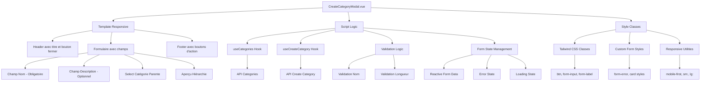
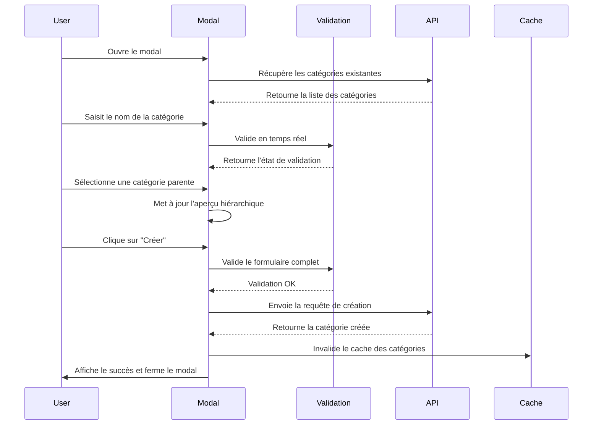
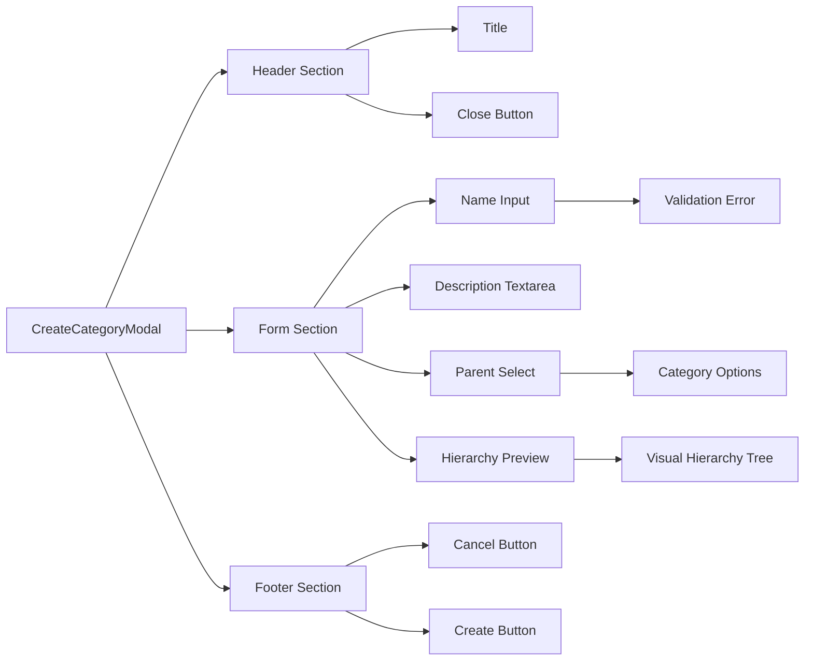
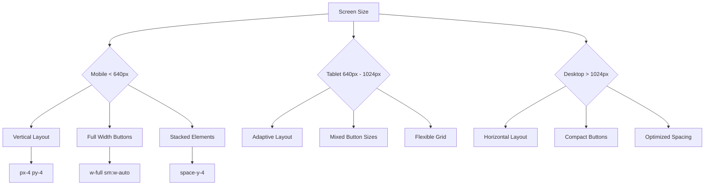
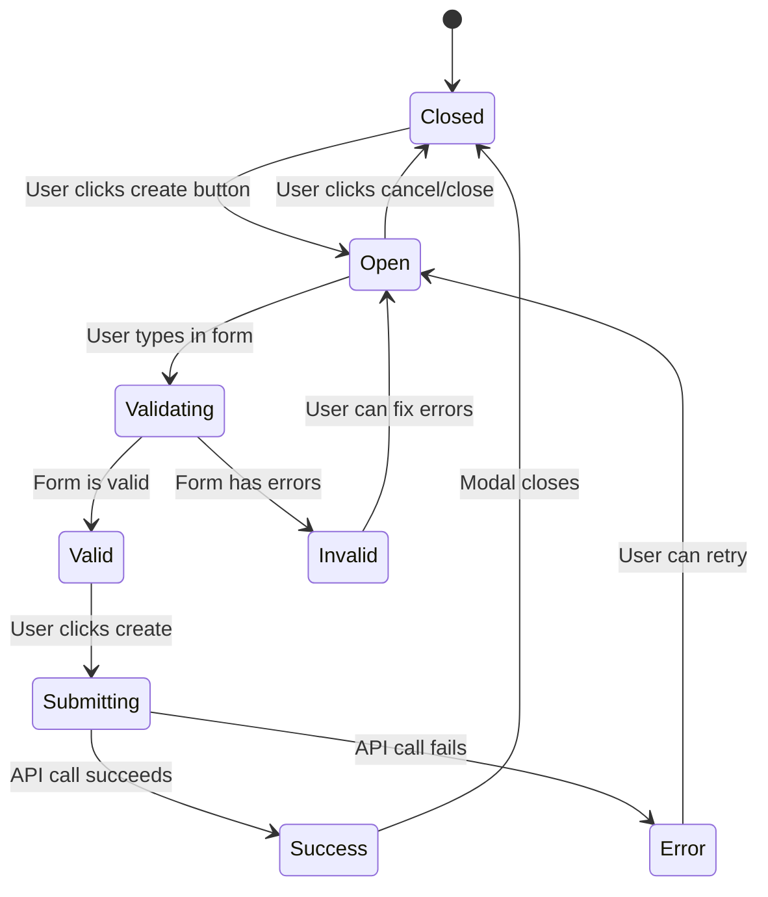
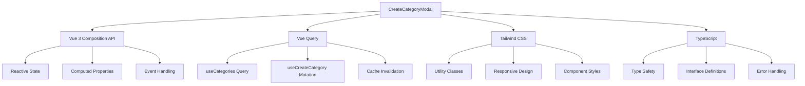

# Architecture du Formulaire de Création de Catégorie

## Diagramme de l'Architecture

## Flux de Données

## Structure des Composants

## Responsive Design

## Gestion des États

## Intégration avec l'Écosystème

## Points d'Extension

Le formulaire est conçu pour être facilement extensible :

1. **Nouveaux champs** : Ajouter dans `form` reactive et `CreateCategoryDto`
2. **Nouvelles validations** : Étendre la fonction `validateForm()`
3. **Nouveaux styles** : Utiliser les classes Tailwind existantes
4. **Nouvelles fonctionnalités** : Ajouter des computed properties et méthodes

## Performance

- **Lazy loading** : Le modal ne se charge que quand nécessaire
- **Validation optimisée** : Validation en temps réel sans surcharge
- **Cache intelligent** : Utilisation de Vue Query pour la gestion du cache
- **Rendu minimal** : Seuls les éléments nécessaires sont rendus
